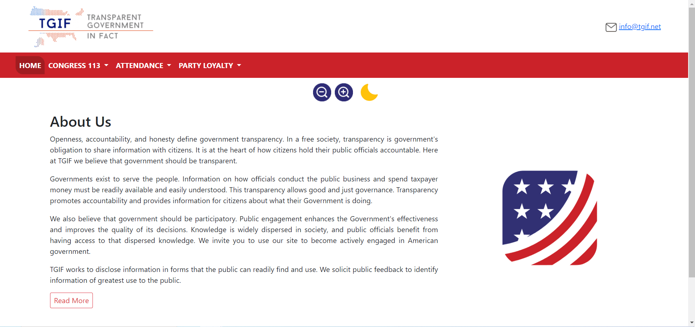

# Transparent Government in Fact

TGIF is a webpage build with HTML, CSS y JS to show some information about USA Congressman and Senators consuming ProPublica Congress API.

## Getting Started 🚀

### Demo

You can see the demo of this project on the following link: [TGIF](https://tgif-dansep.netlify.app/)

### Installation 🔧

If you want to run this project, simply clone the repository and open index.html

You don't need to install any dependencies.

## Technology Stack 🛠️

This project was built using the following technologies

- HTML
- CSS
- JavaScript

---

Developed by [Daniel Sepúlveda](https://github.com/DanSepulveda/)
